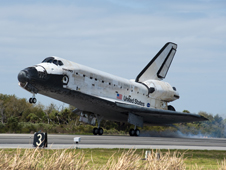

# space_shuttle_autolanding_control 

## Download 
For downloading use 
       `git clone https://github.com/ShaonMajumder/space_shuttle_autolanding_control.git` 
## Data Set Information:

This is a tiny database. Michie reports that Burke's group used RULEMASTER to generate comprehendable rules for determining the conditions under which an autolanding would be preferable to manual control of the spacecraft.

## Attribute Information:

1. Class: noauto, auto 
-- that is, advise using manual/automatic control 
2. STABILITY: stab, xstab 
3. ERROR: XL, LX, MM, SS 
4. SIGN: pp, nn 
5. WIND: head, tail 
6. MAGNITUDE: Low, Medium, Strong, OutOfRange 
7. VISIBILITY: yes, no

## Data Source
Link: https://archive.ics.uci.edu/ml/datasets/Shuttle+Landing+Control